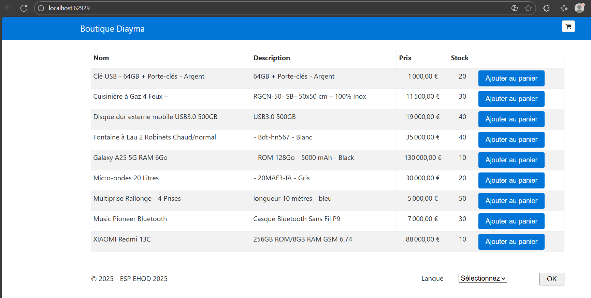

# Boutique Diayma

2- la solution contient trois projets :

1-Diayma: IIS Express - Configuration pour exécuter l'application avec IIS Express
2-Diayma: P2FixAnAppDotNetCode - Le projet principal de l'application
3-Diayma: FolderProfile - Configuration de profil de dossier (probablement pour le déploiement)

3- C est la version 2.0 qui est utilisee
